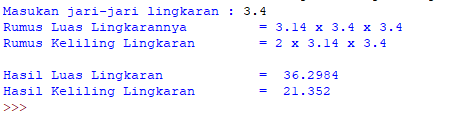

## Menghitung-Luas-dan-Keliling-Lingkaran

## Program Python Cara Menghitung Luas dan Keliling Lingkaran

### Rumus Luas dan Keliling Lingkaran

```bash
Luas     = π × r²
Keliling = 2 x π × r
```



- Nilai phi yang di gunakan adalah 3.14
- r merupakan jari-jari lingkaran</p>

<p>Phi merupakan nilai konstanta di matematika sementara jari-jari merupakan jarak antara titik pusat dengan tepi lingkaran. Sebetulnya ada rumus lain untuk menghitung keliling lingkaran yaitu dengan menggunakan diameter, tapi pada kasus ini kita cukup menggunakan jari jari lingkaran saja.</p>

### Flowchart Menghitung Luas dan Keliling Lingkaran


### Program Menghitung Luas dan keliling Lingkaran

```bash
phi = 3.14

// Input
r = float(input("Masukan jari-jari lingkaran : "))

// Rumus
luas = phi*(r*r)
keliling = 2*phi*r

// Output
print ("Rumus Luas Lingkarannya \t=",phi,"x",r,"x",r,)
print ("Rumus Keliling Lingkaran \t=",2,"x",phi,"x",r,)
print ()
print ("Hasil Luas Lingkaran \t\t= ",luas,)
print ("Hasil Keliling Lingkaran\t= ",keliling,)
```


